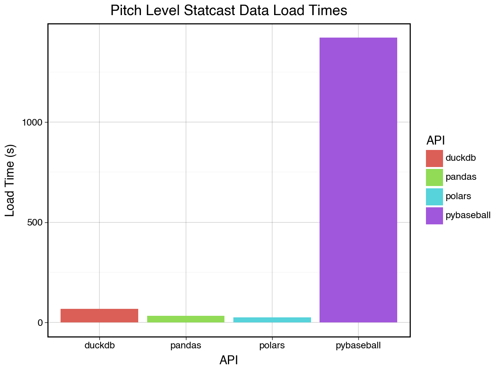

# statcast-era-pitches

[pybaseball](https://github.com/jldbc/pybaseball) is a great tool for downloading baseball data. Even though the library is optimized and scrapes this data in parallel, it can be time consuming. 
 
The point of this repository is to utilize GitHub Actions to scrape new baseball data weekly during the MLB season, and update a parquet file hosted as a huggingface dataset. Reading this data as a huggingface dataset is much faster than scraping the new data each time you re run your code, or just want updated statcast pitch data in general.

The `main.py` script updates each week during the MLB season, updating the [statcast-era-pitches HuggingFace Dataset](https://huggingface.co/datasets/Jensen-holm/statcast-era-pitches) so that you don't have to re scrape this data yourself. 

# Usage

***Pandas***

```python
import pandas as pd

df = pd.read_parquet("hf://datasets/Jensen-holm/statcast-era-pitches/data/statcast_era_pitches.parquet")
```

***Polars***

```python
import polars as pl

df = pl.read_parquet('hf://datasets/Jensen-holm/statcast-era-pitches/data/statcast_era_pitches.parquet')
```

***Duckdb***

```sql
SELECT *
FROM 'hf://datasets/Jensen-holm/statcast-era-pitches/data/statcast_era_pitches.parquet';
```

***HuggingFace Dataset***

```python
from datasets import load_dataset

ds = load_dataset("Jensen-holm/statcast-era-pitches")
```

***Tidyverse***
```r
library(tidyverse)

statcast_pitches <- read_parquet(
    "https://huggingface.co/datasets/Jensen-holm/statcast-era-pitches/resolve/main/data/statcast_era_pitches.parquet"
)
```

see the [dataset](https://huggingface.co/datasets/Jensen-holm/statcast-era-pitches) on HugingFace itself for more details. 

## Benchmarking



| Load Time (s)	| API |
|---------------|-----|
| 1421.103 | pybaseball |
| 26.899 | polars |
| 33.09332203865051 | pandas |
| 68.69287300109863	| duckdb |
