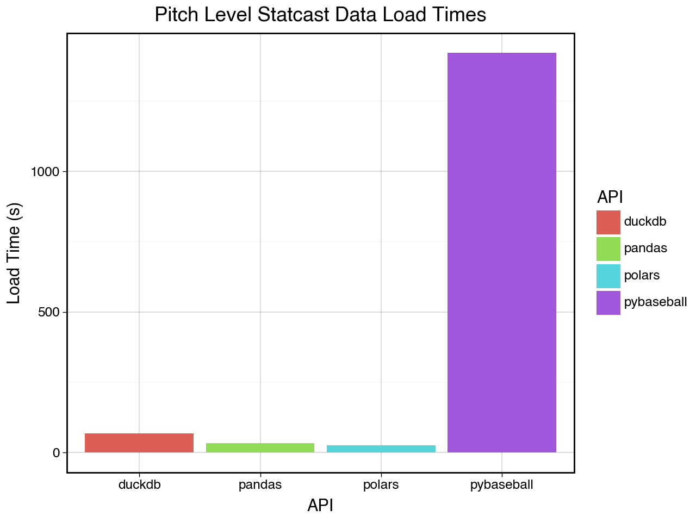

# statcast-pitches

[](https://github.com/Jensen-holm/statcast-era-pitches/actions/workflows/update_statcast_data.yml)

[pybaseball](https://github.com/jldbc/pybaseball) is a great tool for downloading baseball data. Even though the library is optimized and scrapes this data in parallel, it can be time consuming.

The point of this repository is to utilize GitHub Actions to scrape new baseball data daily during the MLB season and update a parquet file hosted directly in this repository. Reading this data from GitHub is much faster than scraping the new data each time you re-run your code, or just want updated statcast pitch data in general.

The `update.py` script updates daily during the MLB season, keeping the Parquet file in this repository up to date so that you don't have to re-scrape this data yourself.

> [!WARNING]
> MLB states that real time `pitch_type` classification is automated and subject to change as data gets reviewed. This is currently not taken into account as the dataset gets updated. `pitch_type` is not the only column affected by this.

# Installation

``` bash
pip install statcast-pitches
```

# Usage

### With statcast_pitches package

**Example 1 w/ polars (suggested)**

``` python
import statcast_pitches
import polars as pl

# load all pitches from 2015-present
pitches_lf = statcast_pitches.load()

# filter to get 2024 bat speed data
bat_speed_24_df = (pitches_lf
                    .filter(pl.col("game_date").dt.year() == 2024)
                    .select("bat_speed", "swing_length")
                    .collect())

print(bat_speed_24_df.head(3))
```

> [!NOTE]
> Because `statcast_pitches.load()` uses a LazyFrame, we can load it much faster and even perform operations on it before 'collecting' it into memory. If it were loaded as a DataFrame, this code would execute in \~30-60 seconds, instead it runs between 2-8 seconds.

**Example 2 w/ SQL**

``` python
import statcast_pitches

# get bat tracking data from 2024
params = ("2024",)
query_2024_bat_speed = f"""
    SELECT bat_speed, swing_length
    FROM pitches
    WHERE 
        YEAR(game_date) =?
        AND bat_speed IS NOT NULL;
    """

bat_speed_24_df = statcast_pitches.load(
    query=query_2024_bat_speed,
    params=params,
).collect()

print(bat_speed_24_df.head(3))
```

**Example 3 w/ SQL file**

``` sql
-- sql/bat_tracking.sql
SELECT bat_speed, swing_length 
FROM pitches 
WHERE 
    YEAR(game_date) =?     
    AND bat_speed IS NOT NULL;
```

``` python
bat_speed_24_df = statcast_pitches.load(
    query='sql/bat_tracking.sql',
    params=(2024,),
) 
```

> [!NOTE]
> If no query is specified, all data from 2015-present will be loaded into a DataFrame. - The table in your query MUST be called 'pitches', or it will fail. - Since `load()` returns a LazyFrame, notice that I had to call `pl.DataFrame.collect()` before calling `head()`


### Alternate Download Methods (not recommended)

If you want to get this data into R or SQL without writing polars first ...

***Duckdb***

``` sql
SELECT *
FROM 'https://raw.githubusercontent.com/Jensen-holm/statcast-era-pitches/main/data/statcast_era_pitches.parquet';
```

***Tidyverse***

``` r
library(tidyverse)

statcast_pitches <- read_parquet(
    "https://raw.githubusercontent.com/Jensen-holm/statcast-era-pitches/main/data/statcast_era_pitches.parquet"
)
```

## Benchmarking



| Eager Load Time (s) | API        |
|---------------------|------------|
| 1421.103            | pybaseball |
| 26.899              | polars     |
| 33.093              | pandas     |
| 68.692              | duckdb     |
